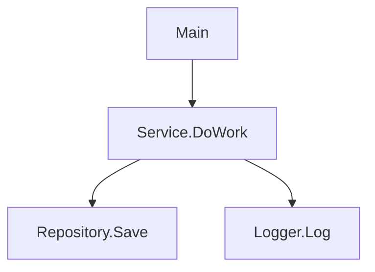

# CGAnzer (Call Graph Analyzer)

## 概要
CGAnzer は Visual Basic (VB) プロジェクトのコールグラフを解析し、Mermaid 記法で可視化する .NET コンソールツールを目指しています。現状の実装は雛形 (Hello, World!) のみで、以下は想定する仕様です。

## 開発フォーカス (VB 解析の方針)
- アナライザー: C# + Roslyn (Microsoft.CodeAnalysis.VisualBasic)
- 対象: VB のモジュール/クラスに含まれるメソッド、関数、プロパティ、イベント、コンストラクター
- 分析: シンボル解決 -> 呼び出し関係の抽出 -> Namespace.Type.Member 形式で正規化
- フィルタリング: 外部参照・自動生成コードを除外しつつ、ローカル関数やラムダも捕捉
- 出力: Mermaid graph TD 形式で Caller --> Callee を生成 (重複エッジはユニーク化)

## リポジトリ構成
- `CGAnzer/CGAnzer/CGAnzer.csproj` - net10.0 のコンソールアプリ雛形
- `CGAnzer/CGAnzer/Program.cs` - 現状のエントリーポイント (Hello, World! のみ)
- `_script/check-licenses.mjs` - npm 依存のライセンスチェック用スクリプト (要設定)
- `.github/workflows/license.yml` - ライセンス検査ワークフローの雛形
- `package.json` / `package-lock.json` / `licenses.json` - npm 設定の雛形
- `LICENSE` - MIT License

## 使い方 (想定仕様)
- 基本: `dotnet run --project CGAnzer/CGAnzer/CGAnzer.csproj -- --input <VBプロジェクトパス> --output <出力パス> [--format mmd|svg|png|pdf]`
- 入力: VB プロジェクト/ソリューション/フォルダーを指定し、`*.vb` を再帰探索。
- 出力:
  - `--format mmd` (デフォルト): Mermaid テキストファイルを生成。
  - `--format svg|png|pdf`: `@mermaid-js/mermaid-cli` を用いて .mmd から図を生成。
- オプション例:
  - `--include <glob>` / `--exclude <glob>`: ファイルやシンボルの絞り込み。
  - `--depth <n>`: 呼び出し階層の深さ制限。
  - `--entry <名前>`: エントリーポイントを指定してサブグラフを生成。
  - `--ignore-external`: 外部アセンブリ呼び出しを省略。

## 解析フロー (VB 想定仕様)
1. Roslyn で VB ソースを構文解析し、SemanticModel を取得。
2. メソッド/関数/プロパティの呼び出し先を列挙し、Namespace.Type.Member に正規化。
3. 重複エッジを除去して graph TD 形式の Caller --> Callee を生成。
4. `--format mmd` の場合は .mmd を出力。
5. `--format svg|png|pdf` の場合は Mermaid CLI を呼び出して図を生成。

### 出力例 (Mermaid)

## 言語サポート拡張の方針
- アナライザーを言語ごとに分離 (例: Analyzers/VB, Analyzers/CSharp) し、共通の「抽出結果 -> Mermaid 変換」パイプラインに流し込む。
- 追加言語の手順:
  1. 対応言語のパーサー/アナライザーで呼び出し関係を抽出するモジュールを追加。
  2. 抽出結果を共通の中間表現 (Caller, Callee, Kind など) にマッピング。
  3. README の「使い方」「解析フロー」「出力例」に該当言語の節を追記。
- Mermaid 出力は共通仕様とし、言語ごとの差異は抽出ロジック側に閉じ込める。

## README 更新チェックリスト
- 仕様: 使い方・解析フロー・出力仕様が最新の想定と一致しているか
- 対応言語: 追加/変更があれば「言語サポート拡張の方針」に反映できているか
- 依存関係: .NET / npm ツールのバージョンや必須オプションを更新したか
- 出力例: 仕様変更に合わせて Mermaid サンプルを更新したか
- 進捗: 実装状況を冒頭で簡潔に明記したか (雛形/ベータ/安定版 など)
